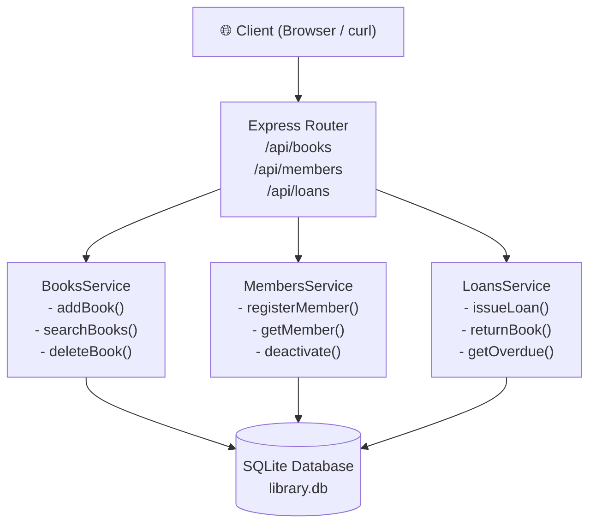
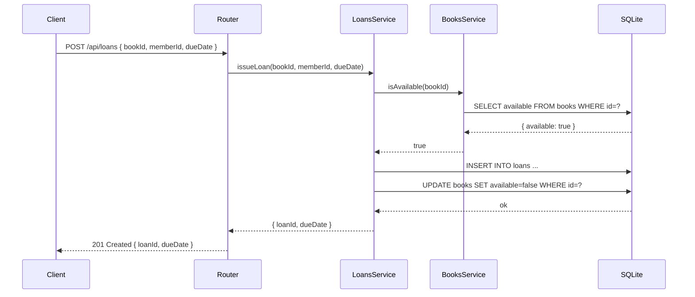
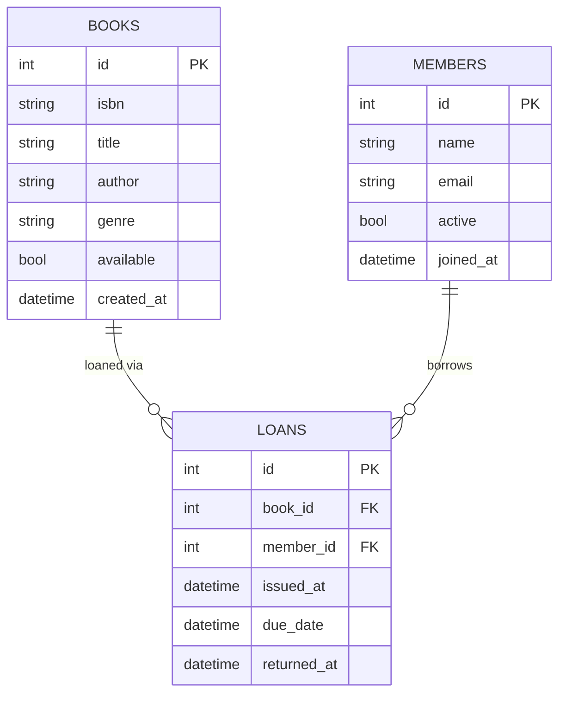

# Architecture — Library Management System

## Module Overview

The system is divided into three layers: **API (Routes)**, **Service (Business Logic)**,
and **Data (SQLite via better-sqlite3)**.

---

## Layer Diagram

---

## Data Flow — Issue a Loan

---

## Database Schema

---

## Module Descriptions

| Module | Path | Responsibility |
|--------|------|----------------|
| `app.js` | `src/` | Express app setup, middleware |
| `server.js` | `src/` | HTTP server entry point |
| `db.js` | `src/db/` | SQLite connection + schema init |
| `books.routes.js` | `src/routes/` | HTTP routes for books |
| `members.routes.js` | `src/routes/` | HTTP routes for members |
| `loans.routes.js` | `src/routes/` | HTTP routes for loans |
| `BooksService.js` | `src/services/` | Book business logic |
| `MembersService.js` | `src/services/` | Member business logic |
| `LoansService.js` | `src/services/` | Loan + overdue logic |
